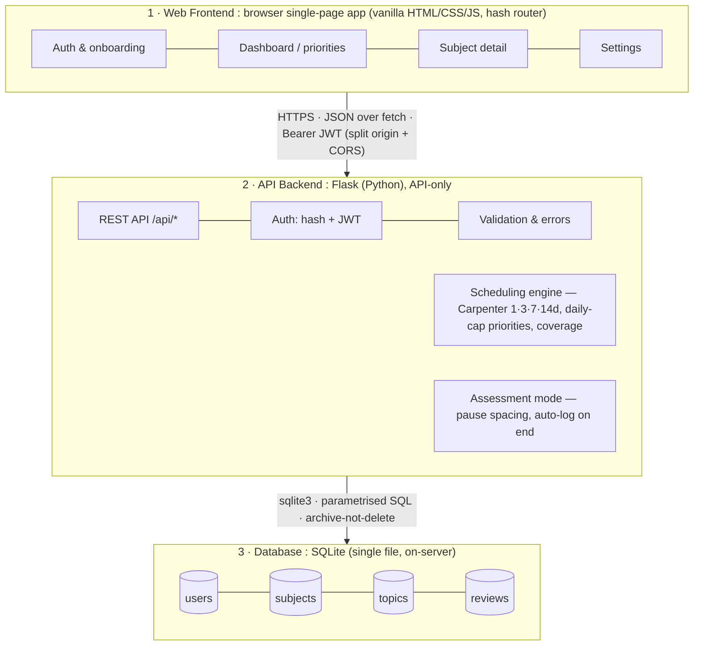

# NCEA Review Navigator

> A web-based, single-URL scheduling dashboard that tells an NCEA student **which topic to review today** —
> using Carpenter's (2012) published spacing intervals across all their subjects.

The Review Navigator is built for **NZ NCEA Level 2 and 3 (Year 12–13) students** managing revision across
4–6 subjects during the long gap between learning content and the **November external examinations**. It
serves one job and serves it completely: removing the daily *"what should I revise?"* decision.

It schedules **when** to study — never **what**. There is no study content, no quizzing, and no gamification.

---

## What it does

- **Subjects & topics** — a student creates subjects (e.g. Biology) and adds the topics they actually
  revise inside them (e.g. Photosynthesis, Cell Division).
- **Log a review** — each time they study a topic they log it in one tap (under 5 seconds).
- **Spaced scheduling** — the engine sets the next due date from the review count using fixed intervals:
  **1 → 3 → 7 → 14 days** (Carpenter, 2012). 14 days is the deliberate maximum for the ~8-month NCEA window.
- **Daily priorities** — the dashboard shows the day's top 3–5 topics, most-overdue first, in encouraging
  language, capped so the student never sees an overwhelming wall of work.
- **Coverage bars** — per-subject progress (% of topics reviewed at least once).
- **Assessment (Internal) Mode** — pauses spacing for a subject during an internal, redirects the daily
  slots to other subjects, and auto-logs every topic when the internal ends (no post-internal flood).

## What it deliberately does **not** do (non-goals)

These are design decisions, not missing features:

1. **No study content or flashcards** — it schedules *when*, the student owns *what* and *how*.
2. **No knowledge testing** — it trusts the student's own revision methods.
3. **No gamification** — no points, badges, or streaks. The goal is exam performance, not app engagement.
4. **No confidence-based interval changes** — confidence (`shaky`/`okay`/`solid`) is stored for the
   student's own reference only; primary research found self-assessment ≈ a coin flip (r ≈ 0.5), so it
   **never** alters the schedule. This is communicated to the user in the UI.
5. **No AI-generated content** — avoids accuracy/bias risk and API cost; not needed for a scheduling tool.

---

## Architecture

Three tiers on a single host. No build tools, no third-party services, no CDN dependencies.



The **scheduling engine** (`scheduling.py`) is pure Python with no Flask or database imports — it takes
plain data in and returns plain data out, so it is trivially unit-testable. Everything else is plumbing
around it.

## Tech stack

| Layer | Choice | Why |
|---|---|---|
| Front-end | Vanilla HTML / CSS / JS (single-page app, hash router) | No framework or build tooling needed for ~4 views; distinctive custom CSS; fast on mobile. |
| Back-end | Flask (Python) | Minimal to a running server; the spacing algorithm stays in native Python. |
| Database | SQLite (`sqlite3`, single file) | No server process, no ORM; privacy-preserving (all data stays on the host). |
| Auth | `werkzeug.security` (password hashing) + `PyJWT` (`Bearer` tokens) | Real accounts → cross-device continuity. |
| Dev glue | `flask-cors` | The split front-end calls the API from a different origin in development. |

> **Identity note.** The original specification proposed anonymous `localStorage` UUIDs (no accounts). This
> implementation instead uses **email + password accounts** — a deliberate iteration that solves the spec's
> #1 known limitation (no cross-device sync) and matches the login mockups. See `CLAUDE.md` → *Spec fidelity*.

---

## Repository layout

```
.
├── README.md                ← this file (human-facing source of truth)
├── CLAUDE.md                ← operating guide for Claude/agents
├── .env.example             ← copy to back-end/.env and fill in
├── docker-compose.yml       ← local stack: web (nginx) + api (Flask)
├── .devcontainer/           ← VS Code devcontainer (uses docker-compose)
├── .github/workflows/ci.yml ← ruff (lint+format) + pytest on push
├── README/                  ← specification docs + mockups
│   ├── NCEA-Review-Navigator-Specification.docx
│   ├── Project-Choices-Overview.docx
│   └── Mockups/
├── back-end/                ← Flask JSON API (Python 3.13)
│   ├── app.py               ← app factory, CORS, blueprint registration, error handlers
│   ├── requirements.txt
│   ├── pyproject.toml       ← ruff (lint + format) + pytest config
│   ├── Dockerfile           ← python:3.13-slim + gunicorn
│   ├── db.py                ← sqlite3 connection helper + init_db()
│   ├── schema.sql           ← table definitions (users → subjects → topics → reviews)
│   ├── auth.py              ← hashing, JWT encode/decode, @require_auth
│   ├── errors.py            ← ApiError + validation helpers
│   ├── scheduling.py        ← PURE-Python spacing engine (no Flask/DB imports; slice 2)
│   ├── routes/              ← auth, user, subjects, topics (slice 2 adds the rest)
│   └── tests/               ← conftest.py, test_api.py (pytest)
└── front-end/               ← static SPA (separate origin), nginx in Docker
    ├── index.html           ← markup only (no inline JS/CSS)
    ├── Dockerfile           ← nginx:alpine
    ├── nginx.conf
    ├── css/                 ← tokens · base · components · screens
    └── js/                  ← ES modules: config, api, dom, state, router, main + screens/
```

> Current state: feature **F1 (auth → onboarding → subjects/topics)** works end-to-end. The scheduling
> engine + priorities dashboard are slice 2. See the *Roadmap*.

---

## Run with Docker (recommended)

> Prerequisites: Docker + Docker Compose.

```bash
docker compose up --build
```

This starts two services on separate origins (CORS bridges them): the static SPA on
**http://127.0.0.1:5500** (nginx) and the JSON API on **http://127.0.0.1:5050** (Flask + gunicorn). The
SQLite file lives on a named volume. Open `http://127.0.0.1:5500` and sign up.

> The API's host port is **5050**, not 5000, because macOS AirPlay Receiver occupies 5000 (it would make
> `docker compose up` and the devcontainer fail to bind). The container still listens on 5000 internally;
> override with `API_PORT` in a root `.env` if you prefer.

The same setup backs the **VS Code devcontainer** (`.devcontainer/`): "Reopen in Container" installs
dependencies and initialises the database automatically.

## Run locally (without Docker)

> Prerequisites: Python 3.13. On macOS: `brew install python@3.13` (the system `python3` may be older —
> use `python3.13` explicitly when creating the venv).

```bash
# 1. Back-end (API on http://127.0.0.1:5050)
cd back-end
python3.13 -m venv .venv && source .venv/bin/activate
pip install -r requirements.txt
cp ../.env.example .env          # then edit .env (see Configuration)
python -c "import db; db.init_db()"   # create the SQLite file from schema.sql
flask --app app run --debug --port 5050   # 5050 avoids the macOS AirPlay :5000 clash

# 2. Front-end (static, e.g. on http://127.0.0.1:5500) — in a second terminal
cd front-end
python3 -m http.server 5500
```

Open `http://127.0.0.1:5500`. The SPA's API base URL defaults to `http://127.0.0.1:5050` (override via
`window.NRN_API_BASE` in `front-end/js/config.js`) and it stores the JWT in `localStorage` (`ncea_token`).

## Quality checks

```bash
cd back-end && source .venv/bin/activate
ruff check . && ruff format --check .   # lint + format
pytest                                  # API tests (auth, onboarding, subjects/topics)
```

## Configuration

Copy `.env.example` to `back-end/.env`:

| Key | Purpose |
|---|---|
| `SECRET_KEY` | Flask secret / JWT signing secret (use a long random value; never commit it). |
| `DATABASE_PATH` | Path to the SQLite file (e.g. `navigator.db`). |
| `FLASK_ENV` | `development` locally. |
| `CORS_ORIGIN` | Allowed front-end origin in dev (e.g. `http://127.0.0.1:5500`). |

---

## API contract (summary)

JSON over HTTPS; authenticated requests carry `Authorization: Bearer <jwt>`.

| Group | Routes |
|---|---|
| Auth | `POST /api/auth/signup`, `POST /api/auth/login`, `GET /api/auth/me`, `POST /api/auth/logout` |
| Onboarding / CRUD | `POST /api/subjects`, `POST /api/topics`, `PUT /api/user/onboarding` |
| Scheduling | `GET /api/priorities`, `POST /api/log-review`, subject/topic `GET/PUT/DELETE` |
| Assessment mode | `POST /api/assessment-mode-start`, `POST /api/assessment-mode-end` |
| Settings | `PUT /api/settings` |

Data model: `users` → `subjects` → `topics` → `reviews`. Subjects and topics are **archived, never
hard-deleted**, so review history is always preserved. Full schema in `back-end/schema.sql`.

## Testing

```bash
cd back-end && source .venv/bin/activate
pytest                       # engine unit tests + API tests (Flask test client)
```

Manual end-to-end checklist: sign up → onboarding (add Biology + a few topics) → confirm rows in SQLite and
the dashboard renders → (engine slice) log a review and confirm `next_due` advances by the correct interval.

**Date safety:** all date arithmetic uses the server's `datetime.date.today()` and ISO `YYYY-MM-DD` strings.
JavaScript `Date` objects are never used in scheduling calculations (this avoids the timezone bugs that have
broken comparable projects).

---

## Roadmap

1. **Foundation** — docs, schema, config, Docker-first scaffold (compose + devcontainer + CI). ✅
2. **Slice 1 / F1** — auth → onboarding → add subject/topic, end-to-end against the real backend, with a
   placeholder dashboard reading the data back. ✅ ← current
3. **Slice 2** — the spaced-repetition engine (`scheduling.py`) with full unit tests, then `GET /api/priorities`
   and `POST /api/log-review`, then hydrate the dashboard and subject-detail screens.
4. **Remaining spec features** — Assessment Mode UI, settings screen, review history, study tips, catch-up
   framing, deployment to a free cloud host.

## Privacy & wellbeing

- A student sees only their own data (isolated by user). Passwords are stored hashed, never in plaintext.
- No analytics, no third-party scripts, no tracking pixels.
- The dashboard footer carries a Youthline contact (`0800 376 633 | Text 234`) by default; the language used
  for overdue/catch-up states is deliberately encouraging — never guilt-inducing, and there are no streaks.

## Research basis

Spacing effect (Ebbinghaus 1885; Cepeda et al. 2006), testing effect (Roediger & Karpicke 2006), and the
fixed interval schedule from **Carpenter (2012)**. Full rationale and primary research are in
`README/NCEA-Review-Navigator-Specification.docx` and `README/Project-Choices-Overview.docx`.
