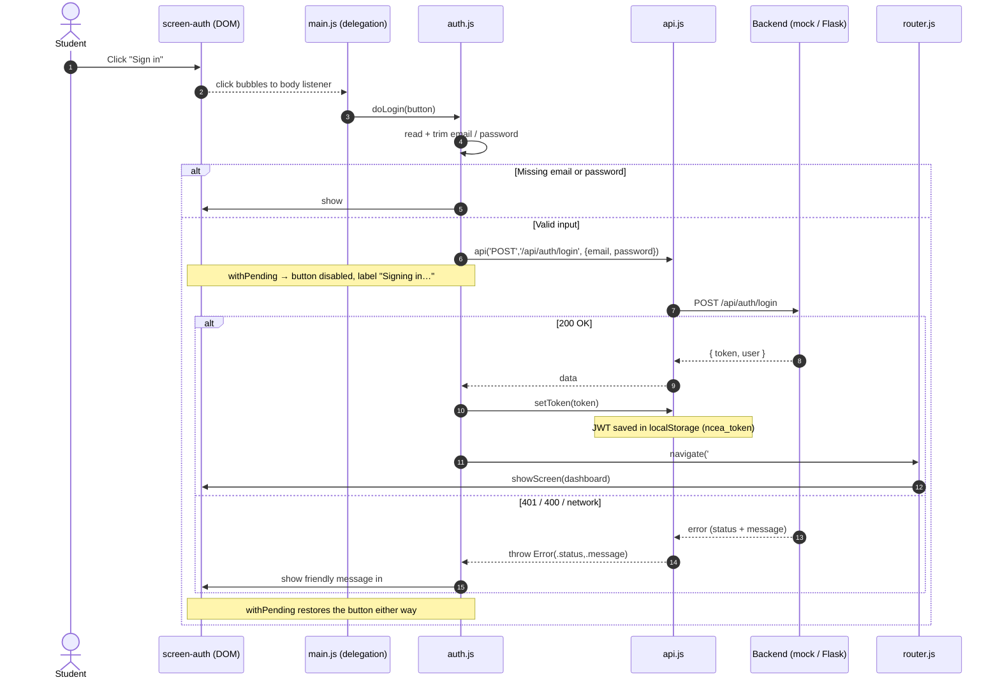
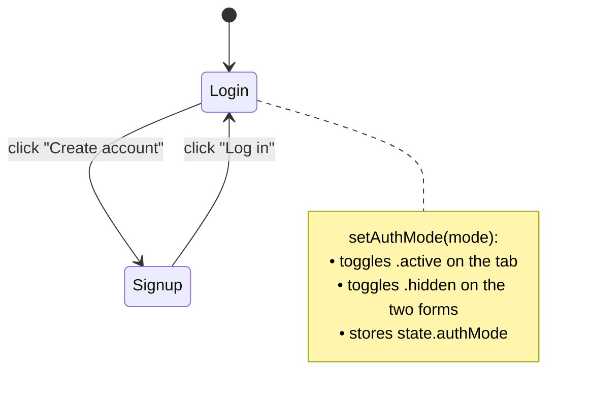

# Auth Screen — Detailed Design

> The login / create-account screen: the app's front door. It authenticates a student,
> obtains a JWT, and hands off to onboarding or the dashboard. This document is the
> single source of truth for its structure, styling, behaviour, and event flow.

- **Scope:** `#screen-auth` only (login + signup). Onboarding and dashboard are separate screens.
- **Audience:** anyone changing the auth UI, its validation, or the auth API contract.
- **Status:** implemented (feature F1), backed by a mock backend by default and Flask when `?real=1`.

---

## 1. Where it lives (file map)

| Layer | File | Responsibility |
|---|---|---|
| Markup | [`front-end/index.html`](../../front-end/index.html) → `#screen-auth` | Static structure: tabs, two forms, error slots, buttons (`data-action` hooks). |
| Behaviour | [`front-end/js/screens/auth.js`](../../front-end/js/screens/auth.js) | `hydrateAuth`, `setAuthMode`, `doLogin`, `doSignup` — read inputs, validate, call the API, route on success. |
| Routing | [`front-end/js/router.js`](../../front-end/js/router.js) | `route()` decides *when* the auth screen shows (no token → auth). |
| Wiring | [`front-end/js/main.js`](../../front-end/js/main.js) | One delegated click listener maps `data-action` → handler; Enter submits. |
| Transport | [`front-end/js/api.js`](../../front-end/js/api.js) | `api()` fetch wrapper + `setToken`; routes to the mock when `USE_MOCK`. |
| Backend | [`back-end/routes/auth.py`](../../back-end/routes/auth.py), [`back-end/auth.py`](../../back-end/auth.py) | `POST /api/auth/{signup,login}`, hashing, JWT, `@require_auth`. |
| Mock backend | [`front-end/js/api.mock.js`](../../front-end/js/api.mock.js) | Same contract, in-browser, for no-backend dev. |
| Skin | [`front-end/css/{screens,components,tokens}.css`](../../front-end/css/screens.css) | `.auth-bg`, `.auth-card`, `.auth-tabs`, `.field`, `.input`, `.error-msg`, `.btn`. |

---

## 2. When the screen appears (routing decision)

`route()` runs on page load and on every `hashchange`. The auth screen is the **logged-out default**.

```mermaid
flowchart TD
    A([router.js runs]) --> B{token in<br/>localStorage?}
    B -- no --> C[show #screen-auth<br/>(auth.js) hydrateAuth]
    B -- yes --> D{currentUser<br/>in memory?}
    D -- no --> E[GET /api/auth/me]
    E -- 200 --> F{onboarding_done?}
    E -- 401/fail --> G[clearToken] --> A
    D -- yes --> F
    F -- no --> H[show #screen-onboarding]
    F -- yes --> I[show #screen-dashboard]

    classDef auth fill:#DBEAFE,stroke:#2563EB,color:#0F172A;
    classDef ok fill:#ECFDF5,stroke:#059669,color:#0F172A;
    class C auth;
    class I ok;
```

**Key invariant:** the only way *off* the auth screen is a successful `setToken(...)` followed by
`navigate('#dashboard')`. An invalid/expired token is wiped and the user is sent right back here.

---

## 3. Component anatomy (DOM structure)

```
#screen-auth .screen
└── .auth-bg                         gradient backdrop, centers the card
    └── .auth-card                   white card, max 440px, shadow-lg
        ├── .brand (.brand-mark "N" + product name)
        ├── .subtitle                "Your daily revision scheduler"
        ├── .auth-tabs               segmented control
        │   ├── button[data-action="auth-tab"][data-mode="login"]   "Log in"
        │   └── button[data-action="auth-tab"][data-mode="signup"]  "Create account"
        ├── #auth-login              (visible by default)
        │   ├── .field  #login-email   (type=email)
        │   ├── .field  #login-pw      (type=password)
        │   ├── p.error-msg #login-err (hidden until an error)
        │   └── button[data-action="do-login"]   "Sign in"
        └── #auth-signup .hidden     (revealed by the signup tab)
            ├── .field #signup-name
            ├── .field #signup-email
            ├── .field #signup-year    (select: Year 12 / Year 13)
            ├── .field #signup-pw
            ├── .field #signup-pw2     (confirm)
            ├── p.error-msg #signup-err
            └── button[data-action="do-signup"]   "Create account"
```

**Design rules honoured:** HTML carries *no* inline JS or CSS; behaviour is attached purely through
`data-action` attributes; every visual value comes from a `tokens.css` variable.

---

## 4. Flow of events — Login



---

## 5. Flow of events — Signup

Same shape as login, with **three client-side guards before the network call**:

```mermaid
flowchart TD
    S([doSignup] auth.js) --> V1{name + email<br/>+ password present?}
    V1 -- no --> E1[#signup-err:<br/>fill required fields]
    V1 -- yes --> V2{password ===<br/>confirm?}
    V2 -- no --> E2[#signup-err:<br/>passwords don't match]
    V2 -- yes --> V3{password<br/>≥ 4 chars?}
    V3 -- no --> E3[#signup-err:<br/>min 4 characters]
    V3 -- yes --> P[POST /api/auth/signup<br/>withPending 'Creating account…']
    P -- 201 --> OK[setToken → navigate '#dashboard']
    P -- 400 dup email --> E4[#signup-err:<br/>account already exists]

    classDef err fill:#FEF2F2,stroke:#DC2626,color:#0F172A;
    class E1,E2,E3,E4 err;
```

On success the new account starts with `onboarding_done = 0`, so `route()` sends the user to
**onboarding** (not the dashboard) on the next pass — see §2.

---

## 6. Tab switching (login ⇄ signup)



`hydrateAuth()` always resets to **Login** mode and clears every field whenever the auth screen is
(re)entered, so a previous failed attempt never leaks into the next visit.

---

## 7. Validation — two layers, one error slot

| Check | Where | Result |
|---|---|---|
| Required fields, password match, min length | Client — `auth.js` | Inline `.error-msg`, **no network call** |
| Duplicate email | Backend — `routes/auth.py` / mock | **400** "An account with that email already exists." |
| Wrong email/password | Backend | **401** "Incorrect email or password." |
| Missing/expired token (later requests) | `@require_auth` | **401** → client wipes token, returns to auth |
| Server unreachable / slow | `api.js` (AbortController, 10 s) | "Couldn't reach the server…" |

Both layers render into the **same** `.error-msg` element (`#login-err` / `#signup-err`) — the user
never sees a blank screen or a raw stack trace.

---

## 8. API contract (auth)

| Endpoint | Body | Success | Failure |
|---|---|---|---|
| `POST /api/auth/signup` | `{name, email, yearLevel, password}` | **201** `{token, user}` | 400 (dup email / short pw / empty) |
| `POST /api/auth/login` | `{email, password}` | **200** `{token, user}` | 401 (bad creds), 400 (missing) |
| `GET /api/auth/me` | — (Bearer token) | **200** `{user}` | 401 |
| `POST /api/auth/logout` | — (Bearer token) | **200** `{ok:true}` | 401 |

`user` shape: `{ id, name, email, yearLevel, onboarding_done }` — **never** the password or its hash.
`token` is a JWT (`sub` = user id, 30-day expiry) carried as `Authorization: Bearer <token>`.

---

## 9. State & storage touched

| Thing | Where | Lifetime |
|---|---|---|
| `state.authMode` | `state.js` (memory) | per page load |
| `state.currentUser` | `state.js` (memory) | until reload / logout |
| `ncea_token` (JWT) | `localStorage` | until logout / `clearToken` |
| `nrn_mock_db` | `localStorage` (mock mode only) | until cleared |

---

## 10. Accessibility & security notes

- Password inputs use `type="password"` + `autocomplete` hints (`current-password` / `new-password`);
  email uses `autocomplete="email"`.
- `withPending` disables the submit button during the request → no double-submit, clear feedback.
- The password is **never** logged, returned, or stored in plaintext (hashed with `werkzeug` server-side).
- Errors are friendly and non-identifying ("Incorrect email or password" — not "no such user").
- Copy is encouraging and non-punitive, per the product's wellbeing stance.

---

## 11. Extension points

- **Forgot password / email verification** — new endpoints + a third tab/screen; routing already
  centralises the "no valid session" path.
- **OAuth / school SSO** — add a provider button to the card; on callback, `setToken` + `navigate`.
- **Field-level inline validation** — attach `input` listeners; reuse the same `.error-msg` slot.
- **Dev fast-login** — a `?demo=1` shortcut can seed a session and skip this screen (see `docs/dev-and-test.md`).
